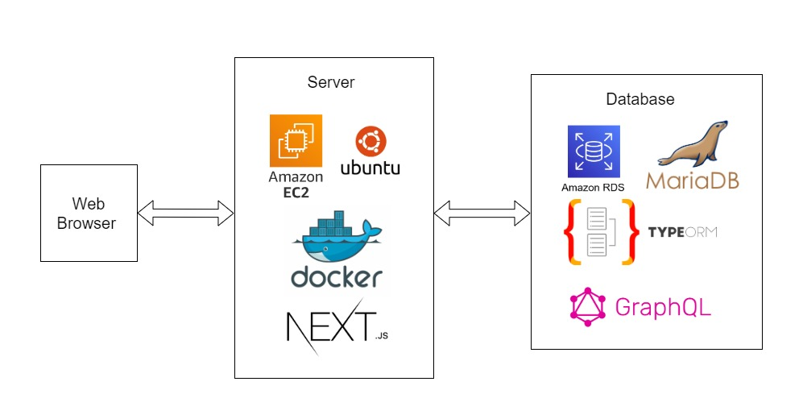

# project-my-homepage
## 개요
### 인프라 구조

## 상세 계획

### 배포

- 멀티프로세싱을 할만큼 많은 트래픽이 들어오지 않으니까 PM2는 필요 없다
    - 자동 재시작 기능은 도커에도 있다
- 프록시서버는 혹시 필요할지도 모르지만 언제든지 붙이면 그만이다
    - 모듈화는 개발자의 기본 소양이다. 변경을 두려워하면 안된다.

### API

- GraphQL
    - 트렌드에 뒤쳐지지 않게 React Query와 GraphQL 중에 하나를 배워보고 싶다
    - React Query는 REST API의 연장선상이고 대량의 트래픽을 처리하는 데에 적합한 것 같다
    - GraphQL은 새로운 패러다임이고 다양한 기능을 빠르게 구현하는 데에 적합한 것 같다

### DB

- MariaDB
    - DB를 하나만 쓸거면 그래도 NoSQL보다는 RDBMS를 쓰는 게 맞는 것 같다
- TypeORM
    - 쿼리문은 많이 써봤으니까 이제 ORM을 써보고 싶다

### 도메인

- dev 도메인을 사용하고 싶은데 https 연결이 필수사항인가보다
- Let's Encrypt라는 기관에서 무료로 인증서를 발급해준다
    - 유효기간이 90일 밖에 안 되지만 Certbot이라는 툴을 사용하면 자동화가 가능한듯